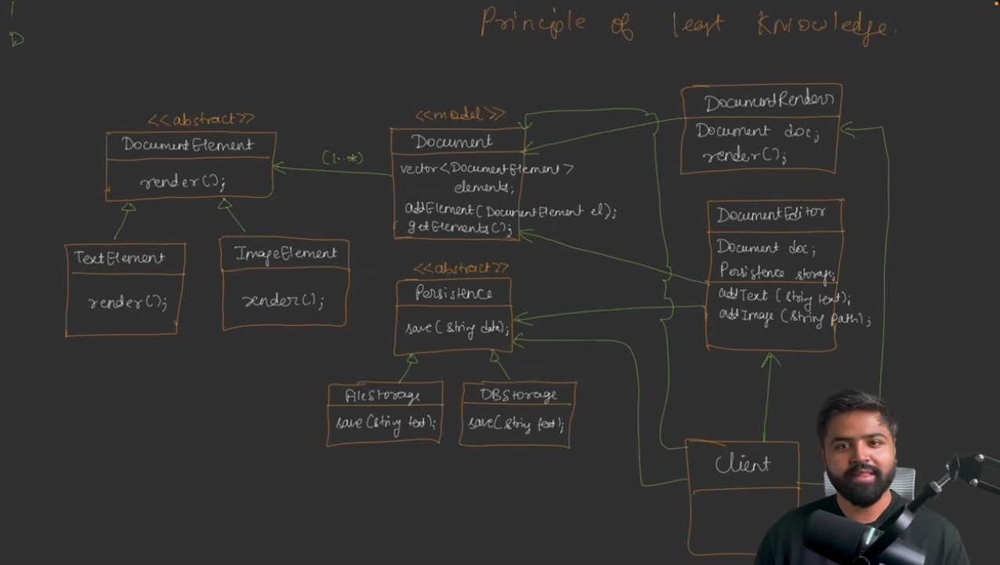

This is the final design of our document editor. But it still has some conflicts. 

1. Principle of least knowledge is being violated.
2. If we go back to the previous design that is code implemented, we can see that the *Document* class has the knowledge of more than one reason to change. If the render method method from Document Editor changes, then the Document class will also need to change. This is a violation of the Single Responsibility Principle. If the save method from the persistence layer changes, then the Document class will also need to change. This is also a violation of the Single Responsibility Principle. But this is controversial, because if we go by the new design then we break principle of least knowledge.