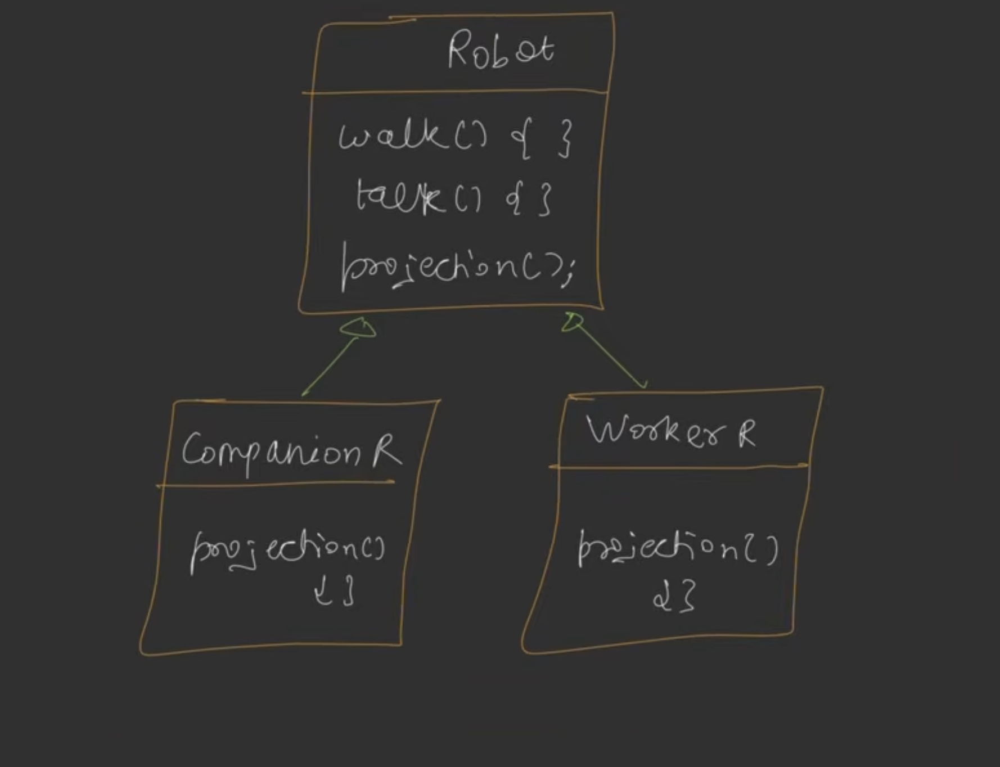
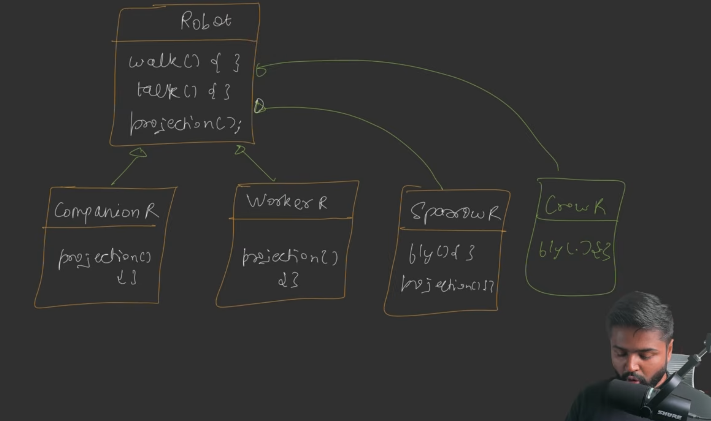
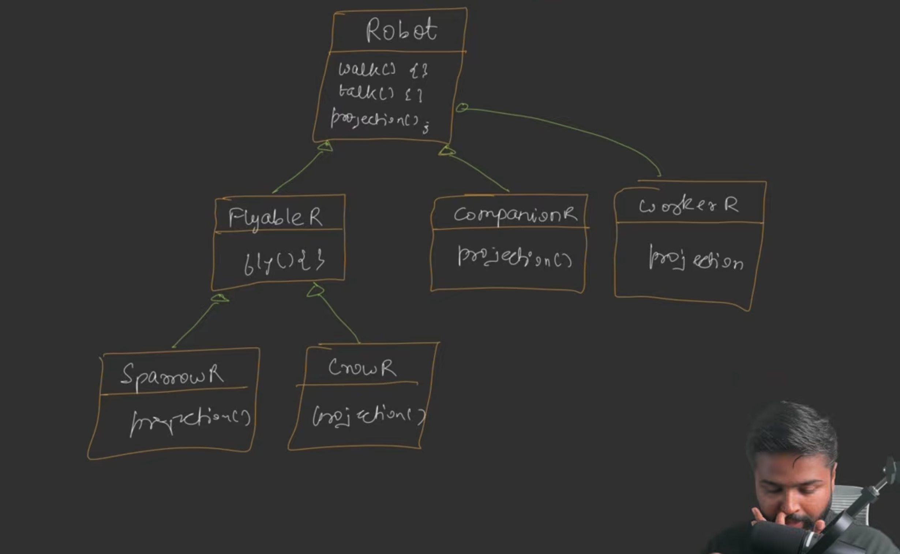
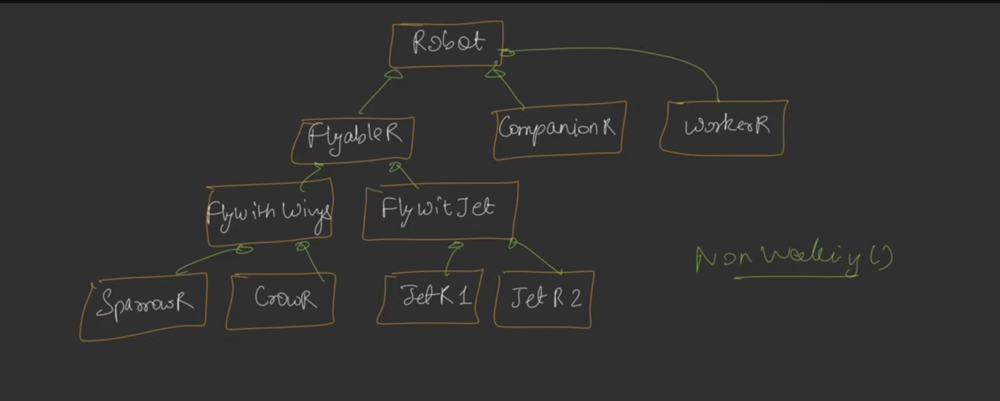
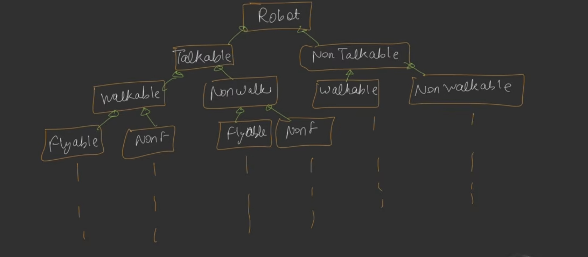
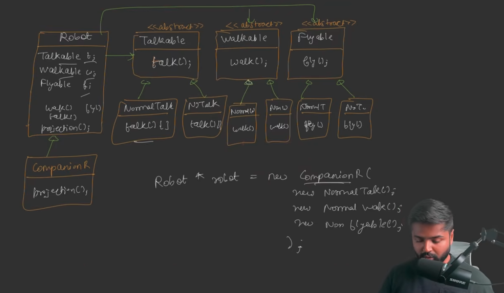
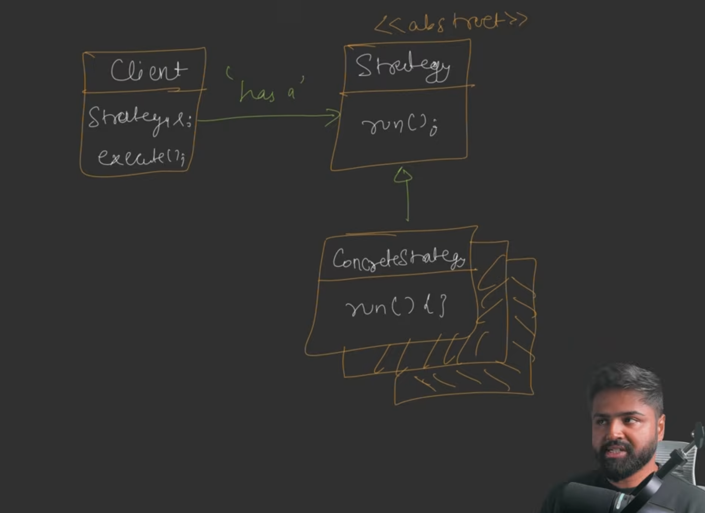

## **Strategy Design Pattern: Comprehensive Study Notes**

### **1. Introduction to Design Patterns**
*   **Definition:** Design patterns are **proven solutions to common problems** encountered during application development. They leverage the wisdom of experienced developers to provide a path for solving recurring architectural challenges.
*   **The Goal of Flexibility:** Applications constantly evolve. A "flexible design" is one where **new features can be integrated with minimal code changes and minimal time**.
*   **Core Principle:** Almost all design patterns focus on identifying the **static parts** of an application (which don't change) and the **dynamic parts** (which change frequently). The goal is to **extract the dynamic parts** into separate classes so they do not affect the static components.

---

### **2. The Problem: Why We Need the Strategy Pattern**
The video uses a **Robot Simulation** example to illustrate how traditional inheritance fails as an application grows.

**Initial Design using Inheritance:**
*   A base `Robot` class is created with methods like `walk()`, `talk()`, and an abstract `projection()` (how it looks).
*   Subclasses like `CompanionRobot` and `WorkerRobot` inherit from `Robot` and override `projection()`.

**The Failure Points of Inheritance:**
1.  **Code Duplication (DRY Principle):** When a new `SparrowRobot` is added that can `fly()`, and later a `CrowRobot` is added that also flies, the same flying code is copied into both classes. This violates the **"Do Not Repeat Yourself" (DRY)** principle.

    

2.  **Unintended Side Effects:** If you put `fly()` in the parent `Robot` class to share code, suddenly *all* robots (including those that shouldn't fly) gain the flying behavior.
3.  **Inheritance Hell (Combinatorial Explosion):**
    *   Attempting to solve the "flying" problem by creating a `Flyable` sub-hierarchy leads to a "slippery slope".
    
    *   If some robots fly with **wings** and others with **jets**, you need more sub-classes (`FlyWithWings`, `FlyWithJet`).
    
    *   When you combine multiple behaviors (e.g., Talkable vs. Non-Talkable, Walkable vs. Non-Walkable, Flyable vs. Non-Flyable), the **inheritance tree becomes massive and unmanageable** because you have to create a class for every possible permutation.
    
4.  **Violation of Open-Closed Principle:** Every new feature requires modifying existing hierarchies or adding complex layers, making the code rigid.

---

### **3. The Solution: How the Strategy Pattern Works**
The Strategy Design Pattern solves these issues by **favoring composition over inheritance**.

**Key Strategy Concepts:**
*   **Definition:** It defines a **family of algorithms**, encapsulates each one in a **separate class**, and makes them **interchangeable at runtime**.
*   **Separation of Concerns:** Volatile behaviors (like walking, talking, and flying) are extracted from the `Robot` class and turned into **Interfaces** (or abstract classes).
*   **Concrete Strategies:** You create specific implementation classes for each interface. For example:
    *   **Flyable Interface:** Implementations include `NormalFly`, `JetFly`, and `NoFly`.
    *   **Talkable Interface:** Implementations include `NormalTalk` and `NoTalk`.

**The "Dumb" Robot (The Client):**
*   The `Robot` class (the Client) no longer contains the logic for walking or flying.
*   Instead, it contains **references** to the behavior interfaces (`Walkable`, `Flyable`, `Talkable`).
*   **Delegation:** When `robot.walk()` is called, the Robot simply **delegates** the request to the stored `Walkable` reference: `walkable.walk()`.
    

### NOTE: INFOGRAPHIC

---

### **4. Benefits of the Strategy Pattern**
*   **Runtime Flexibility:** You can change a robot's behavior at runtime by simply passing a different strategy object into its constructor or a setter.
*   **Easy Scalability:** To add a "Rocket Flying" behavior, you only need to create one new class that implements the `Flyable` interface. **No changes are required to the `Robot` class** or existing flyable classes.
*   **Supports Open-Closed Principle:** The system is open for extension (new behaviors) but closed for modification (existing core code remains untouched).
*   **Eliminates Complex Hierarchies:** You no longer need hundreds of classes for every combination of traits; you just mix and match strategy objects.

---

### **5. Real-World Applications**
Beyond robots, the Strategy pattern is widely used in:
*   **Payment Systems:** A `PaymentSystem` class can have a `pay()` method that uses different strategies like **UPI, Credit Card, or Net Banking**.
*   **Sorting Algorithms:** A sorting utility can switch between **QuickSort, MergeSort, or InsertionSort** depending on the data or user preference.
*   **Standard UML:** The pattern consists of a **Client** (e.g., Robot), a **Strategy Interface**, and multiple **Concrete Strategies** (implementations).
    