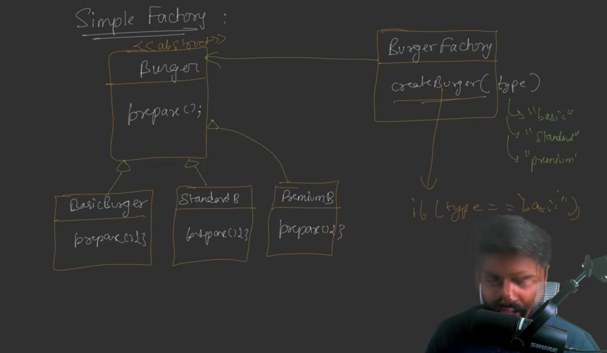
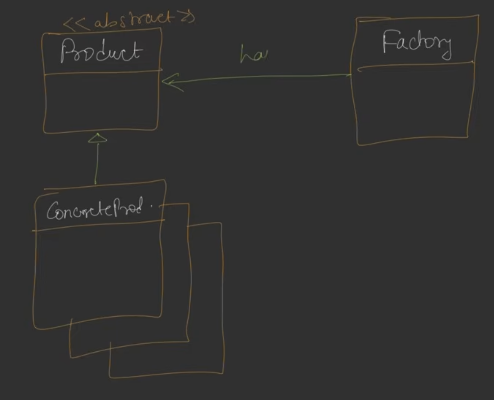
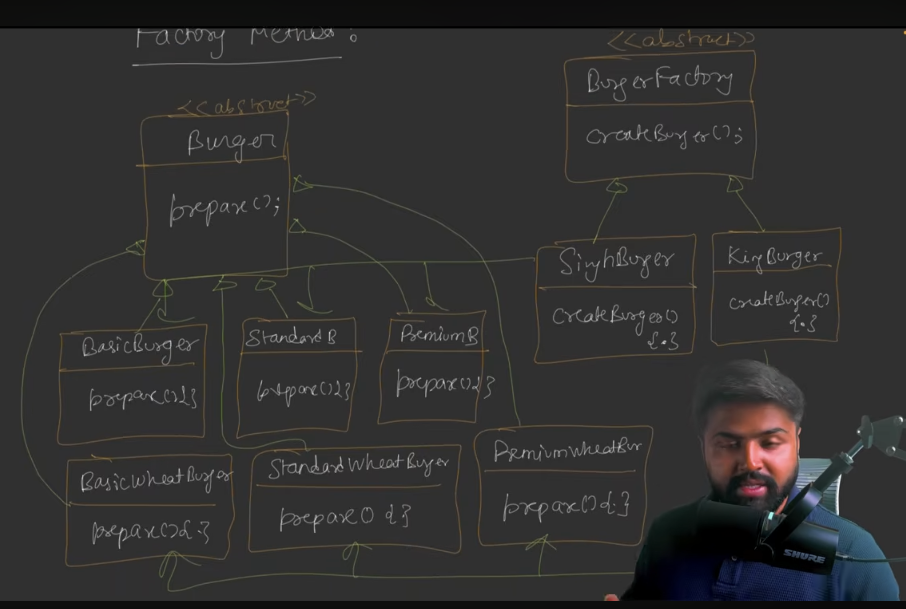
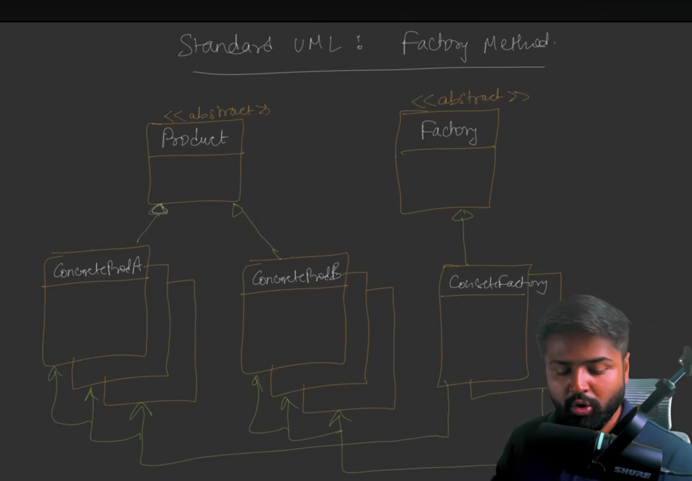
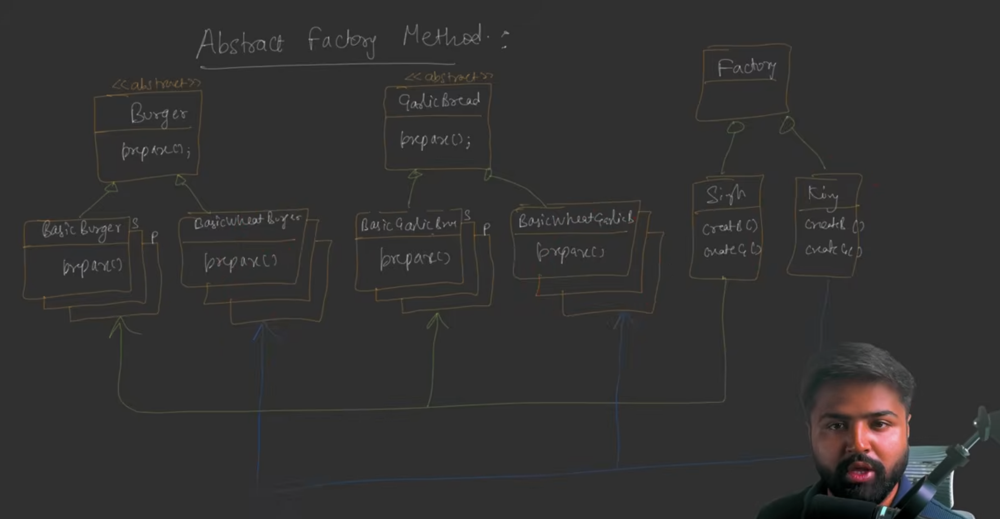
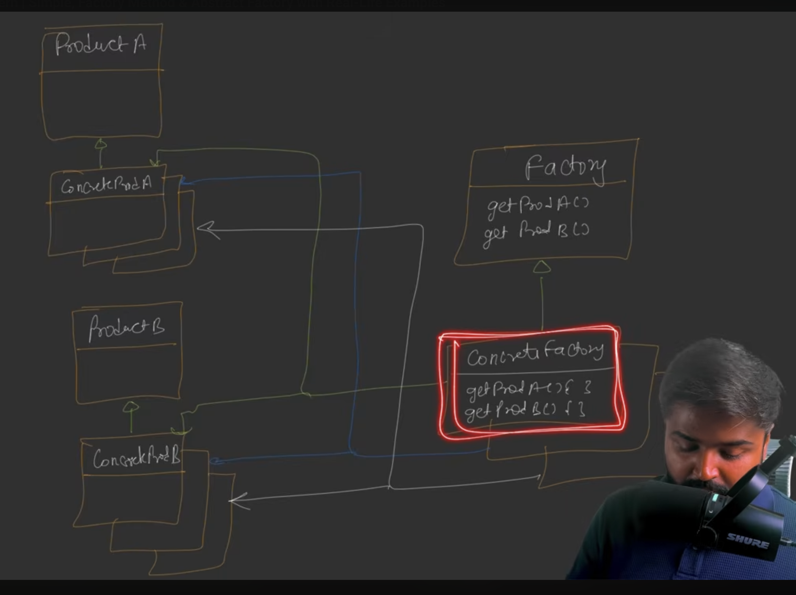

### **Factory Design Pattern: Comprehensive Study Notes**

The **Factory Design Pattern** is one of the most widely used creational patterns in Low-Level Design (LLD). Its primary goal is to manage and encapsulate the process of **object creation**, ensuring that the business logic of an application remains separate from the logic required to instantiate objects.

---

### **1. The Core Motivation: Decoupling and Separation of Concerns**

*   **The Problem:** In many applications, the "Business Logic" (how the app works) and "Object Creation Logic" (using the `new` keyword) are mixed together. For example, if a notification system has to decide whether to create an `SMSNotification` or `EmailNotification` object based on user input, that logic clutters the main code. This leads to code that is **complex to read**, **difficult to maintain**, and **tightly coupled** to concrete classes.
*   **The Solution:** Extract the object creation logic into a separate class called a **Factory**.
*   **Key Aim:** The client should not know *how* an object is created or what computations are involved; it should simply ask the Factory for an object and receive it.

---

### **2. Simple Factory (A Design Principle)**
While often called a pattern, Simple Factory is technically a **design principle** where a single class handles the instantiation of different objects.

**A Factory class that decides which concrete class to instantiate.** 

*   **The Problem (Burger Shop Example):** A shop sells **Basic**, **Standard**, and **Premium** burgers. If the client code manually uses `new BasicBurger()` or `new StandardBurger()`, it becomes dependent on those specific concrete classes.
*   **The Solution:** Create a **`BurgerFactory`**.
    
*   **Mechanism:** 
    *   The `BurgerFactory` has a method `createBurger(type)` that takes a string (e.g., "Premium").
    *   Inside this method, an `if-else` or `switch` statement decides which concrete class to instantiate.
    *   **Result:** The client only interacts with the `Burger` interface and the Factory, making the system easier to manage.
    

---

### **3. Factory Method Pattern (Scaling Production)**
This is a formal design pattern that uses inheritance to allow subclasses to decide which class to instantiate.

*   **The Problem (The Franchise Dilemma):** Suppose the burger shop expands into two franchises: **Singh Burger** (makes normal burgers) and **King Burger** (makes wheat-based healthy burgers). A single Simple Factory cannot handle these different "styles" of making the same product without becoming overly complex.
*   **Definition:** Defines an interface for creating Objects but allows subclasses to decide which class to instantiate.
*   **The Solution:** Make the **Factory itself an Abstract Class** or Interface.
*   **Mechanism:** 
    *   The base `BurgerFactory` defines an abstract `createBurger()` method.
    *   Each franchise (subclass) implements this method:
        *   `SinghBurgerFactory` returns normal Basic/Standard/Premium burgers.
        *   `KingBurgerFactory` returns **Wheat-based** Basic/Standard/Premium burgers.
    *   **Result:** The client chooses the *factory* (franchise) at runtime, and that factory handles the specific creation logic.
    
    

---

### **4. Abstract Factory Pattern (Families of Related Products)**
This pattern is an extension of the Factory Method, used when you need to create "families" of related objects.

In Abstract Factory, the goal is to create a family of related products together, not each product in isolation.

*   **The Problem (The Meal Deal):** The shop now wants to sell **Garlic Bread** alongside Burgers. You must ensure that if a customer goes to a "Wheat-based" shop (King Burger), they get both a **Wheat Burger** AND **Wheat Garlic Bread**. If you use separate factories for each, you risk inconsistency (e.g., mixing a normal burger with wheat bread).
*   **The Solution:** Use a **`MealFactory`** (an Abstract Factory) that produces multiple related products.
    
*   **Mechanism:**
    *   The `MealFactory` interface has multiple methods: `createBurger()` and `createGarlicBread()`.
    *   Concrete Factories (e.g., `KingBurgerMealFactory`) implement all these methods to return a consistent "family" of wheat products.
    *   **Definition:** It provides an interface for creating families of related objects without specifying their concrete classes.

    

---

### **5. Strategy Pattern vs. Factory Pattern**
The sources highlight that both patterns can sometimes solve the same problem (like a **Notification System**), but their **intent** is different.

| Feature | **Strategy Pattern** | **Factory Pattern** |
| :--- | :--- | :--- |
| **Primary Intent** | To vary an **algorithm** or behavior at runtime. | To hide the complexity of **object creation**. |
| **Object State** | Assumes objects/strategies are already created (Dependency Injection). | Responsible for actually creating the objects using `new`. |
| **Focus** | How an object **behaves**. | How an object is **produced**. |

**Recommendation:** If you need to swap algorithms at runtime, use **Strategy**. If you want to decouple your business logic from the `new` keyword and concrete class names, use **Factory**.