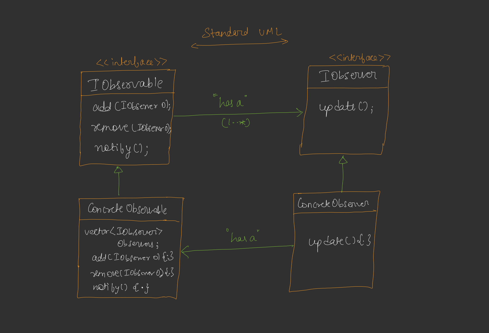
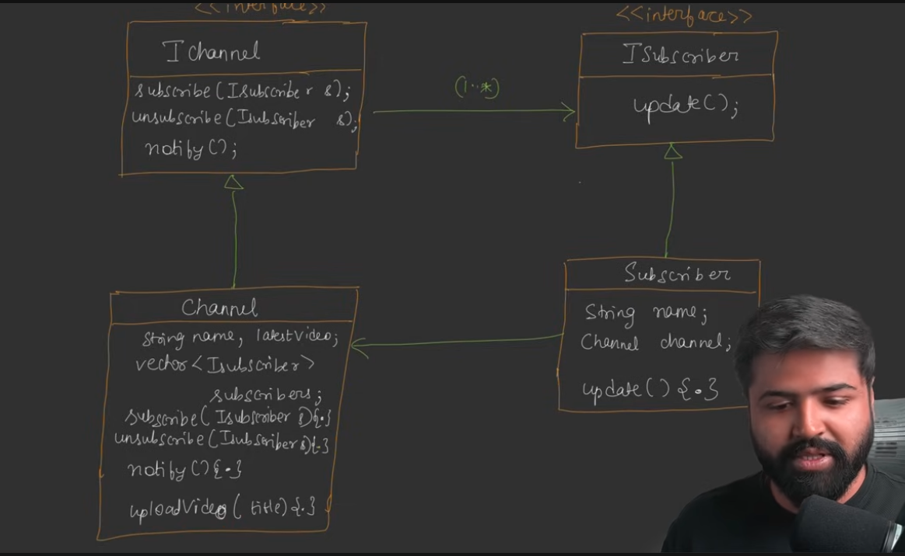

These notes are based on the provided transcript regarding the **Observer Design Pattern**.

### **1. The Reason and Problem Statement**
The core problem the Observer pattern solves occurs when one object needs to know about the state changes of another object. 
*   **The Inefficiency of Polling:** Without this pattern, objects often use a "polling" technique, where an observer repeatedly asks the subject, "Has your value changed?". This is time-consuming, resource-heavy, and requires determining a check frequency (e.g., every second), which is often inefficient.
*   **The Solution (Pushing):** The pattern shifts the responsibility from the observer to the **observable**. Instead of the observer asking, the observable "pushes" notifications to all interested observers the moment its state changes.

### **2. Definition and Objectives**
*   **Definition:** It defines a **one-to-many relationship** between objects so that when one object changes state, all its dependents (observers) are notified and updated automatically.
*   **What we want to achieve:** We aim to create a decoupled system where a subject can communicate state changes to a dynamic list of subscribers without knowing the specific details of those subscribers.

### **3. UML and Relationship Explanation**
The pattern relies on two primary entities: the **Observable** (Subject) and the **Observer**.

#### **Key Classes and Interfaces**
*   **`IObservable` (Interface):** A pure abstract class (contract) that defines three main methods:
    *   `add(IObserver)`: To subscribe/add a new observer to the list.
    *   `remove(IObserver)`: To unsubscribe/remove an observer.
    *   `notify()`: To loop through the collection of observers and call their update methods.
*   **`IObserver` (Interface):** Defines the `update()` method, which is called by the observable when a change occurs.
*   **`ConcreteObservable`:** Implements the `IObservable` interface and maintains the actual **list (vector or map)** of subscribers.
*   **`ConcreteObserver`:** Implements `IObserver` and defines how to react when notified (e.g., fetching new data).

#### **Relationships**
*   **One-to-Many:** There is one observable and multiple observers.
*   **Composition (Has-a):** 
    *   The `ConcreteObservable` **has-a** list of `IObserver` objects to notify.
    *   The `ConcreteObserver` **has-a** reference to the `ConcreteObservable`. This allows the observer to call a "getter" method (like `getValue()`) on the subject to retrieve the specific data that changed.

---

### **4. The YouTube Example**
The video uses a YouTube subscription system to illustrate the pattern:
*   **The Subject (Observable):** A YouTube Channel (`IChannel`). It maintains a list of subscribers.
*   **The Observers:** User accounts (`ISubscriber`).
*   **UML:**
     
*   **The Process:** 
    1.  Users call a `subscribe()` method, adding themselves to the channel's internal list.
    2.  When the channel calls `uploadVideo(title)`, it internally triggers the `notifySubscribers()` method.
    3.  `notifySubscribers()` loops through the list of accounts and calls `update()` on each one.
    4.  The `update()` method in the subscriber class uses its stored channel instance to call `getVideoData()`, allowing the user to see the new video title.

---

### **5. Violation of Single Responsibility Principle (SRP)**
The transcript notes that a standard implementation of the Observer pattern often breaks **SRP**.
*   **The Conflict:** The `ConcreteChannel` handles two distinct responsibilities:
    1.  **Observer Management:** Managing the list of subscribers (add, remove, notify).
    2.  **Business Logic:** Handling actual channel features like uploading videos and managing video data.
*   **The Trade-off:** While this can be fixed by moving the subscription logic into the `IObservable` interface itself (rather than keeping it abstract), the speaker suggests that the current trade-off is often acceptable in LLD to keep the pattern simple and easy to understand.

---

### **6. Real-Life Use Cases**
Beyond YouTube notifications, the Observer pattern is widely used in:
1.  **Notification Services:** Any system sending alerts (Email, SMS, Push) when an event occurs.
2.  **News Feeds:** Social media platforms (Facebook, Instagram) notifying followers/friends when a new post is uploaded.
3.  **Event Handling:** In front-end development, "Event Listeners" are a form of the Observer pattern where objects wait for specific UI events (like a button click) to trigger a response.
4.  **Stock Market Apps:** Multiple displays or users needing real-time updates when a stock price changes.