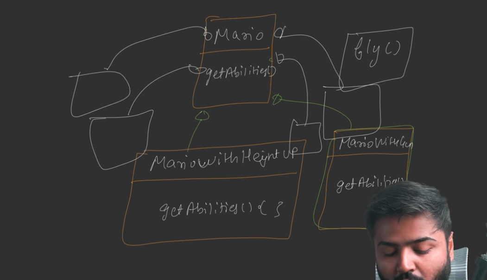
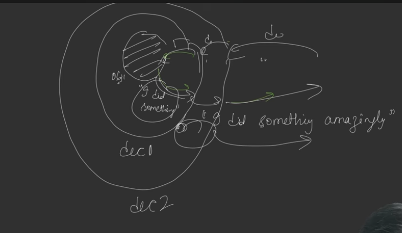
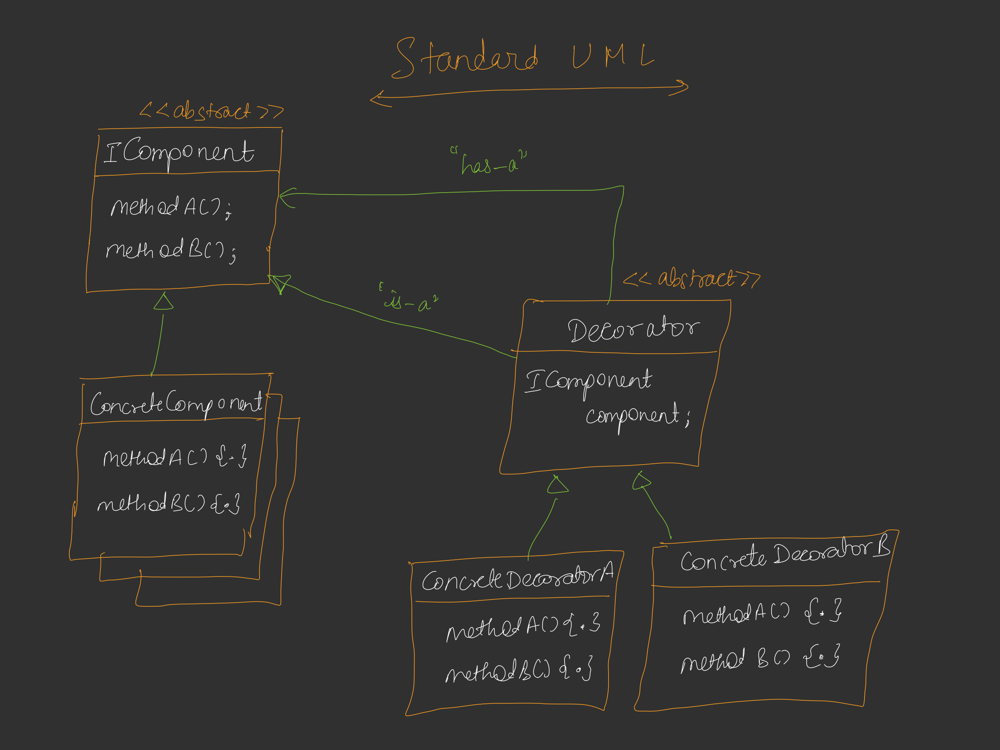
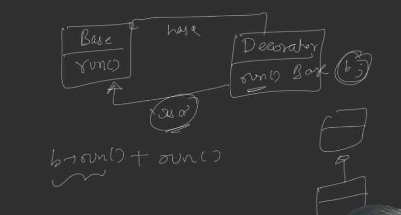
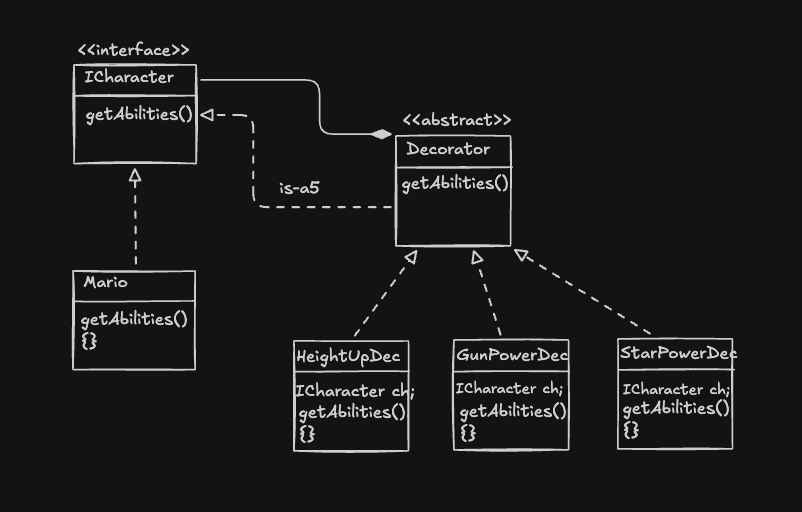
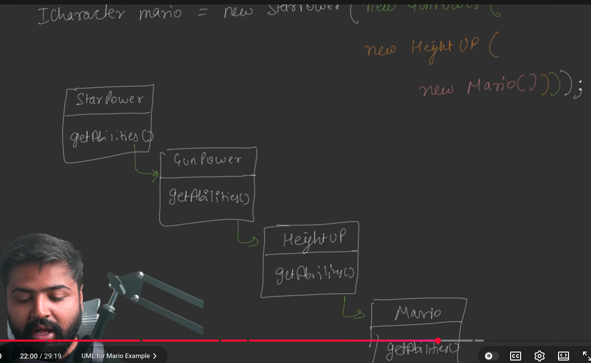

## **1. The Problem: Dynamic Responsibilities**
The core problem we are trying to solve is how to provide **additional responsibilities or functionalities to an object at runtime**. Instead of having a fixed set of features determined at compile time, we want to be able to change or enhance an object's behavior dynamically based on specific conditions or user actions.

### **Decorator pattern attaches additional responsibilities to an object dynamically. Decorator provides a flexible alternative to subclassing for extending functionality.**

## **2. The Naive Method: Inheritance**
The standard approach most developers first consider is **Inheritance**. In this model, you have a base class and create child classes to override methods and provide enhanced functionality.

**The Problem with Inheritance:**
*   **Class Explosion:** As you add more features, the number of subclasses required to handle every possible combination of features grows exponentially. 
*   **Rigid Hierarchy:** Inheritance creates a long, complex hierarchy that is difficult to manage. Every new change or feature often requires restructuring the entire tree.
*   **Poor Scalability:** For example, in a game like Mario, if you want a character that has a "Height Up" power, "Gun" power, and "Flying" power, you would need to create a specific class for every permutation (e.g., `MarioWithHeightAndGun`, `MarioWithGunAndFly`, etc.).

## **3. The Efficient Approach: Decorator Pattern (First Principles)**
The efficient approach is to favor **Composition over Inheritance**. Instead of creating a new class for every combination, we "wrap" or "decorate" the base object with other objects.

*   **The Wrapper Concept:** You take a base object (e.g., `Mario`) and wrap it inside a **Decorator** object.
*   **Delegation:** When a method is called on the Decorator, it first calls the same method on the object it is wrapping, gets the result, enhances it with its own logic, and then returns it to the client.
*   **Infinite Stacking:** These decorators can be stacked infinitely. You can wrap a "Gun Decorator" around a "Height Decorator," which is already wrapping the base "Mario" object.

## **4. How This Solves the Problem**
This approach solves the problem of "Class Explosion" because you only need one class per individual feature (e.g., one `Gun` class, one `Fly` class). You can then combine these features in **any order or combination at runtime** using the constructors, without needing a dedicated class for every permutation.

## **5. UML Diagram Explanation**
The Decorator pattern uses a unique structure involving two types of relationships simultaneously:

*   **IComponent (Interface/Abstract Class):** The base contract that defines the methods both the real object and the decorators must follow (e.g., `getAbilities()`).
*   **Concrete Component:** The basic object that does the core work (e.g., the `Mario` class).
*   **Decorator (Abstract Class):** This is the heart of the pattern. It has two relationships with the Component:
    
    1.  **Is-a Relationship:** It inherits from the Component so it can behave like the object it is decorating.
    2.  **Has-a Relationship (Composition):** It holds a reference to a Component object so it can delegate calls to it.
*   **Concrete Decorators:** Classes like `HeightUpDecorator` or `GunPowerDecorator` that implement the specific enhancement logic.

## **6. Example Explanation: Mario Power-ups**
Based on the sources, the **Decorator Design Pattern** is explained through the classic game **Mario** to illustrate how to add responsibilities to an object dynamically at runtime without creating a rigid and unmanageable class structure.

### The Example: Mario Power-ups
The scenario involves the character **Mario**, who starts the game with basic abilities. As he progresses, he collects power-ups that enhance his functionality:
*   **Mushroom:** Increases his height (**Height Up**).
*   **Flower:** Gives him **Gun Shooting** abilities.
*   **Star:** Provides limited-time speed and invincibility (**Star Power**).
*   **New Features:** Future updates might include a **Flying** ability.

The goal is to design a system where Mario’s behavior can be enhanced dynamically depending on which items he picks up.

### The Wrong Approach: Inheritance
The naive or "wrong" way to solve this is by using **Inheritance**.
*   **Implementation:** You would create a base `Mario` class with a method like `getAbilities()`. To add power-ups, you would create child classes such as `MarioWithHeightUp`, `MarioWithGun`, and `MarioWithStar`.
*   **The "Class Explosion" Drawback:** As you want to support combinations (e.g., Mario with both Height Up and Gun abilities), you are forced to create specific classes for every possible permutation: `MarioWithHeightAndGun`, `MarioWithHeightAndStar`, `MarioWithGunAndStar`, etc.
*   **Scalability Issues:** If a new ability like "Flying" is introduced, the number of required classes grows exponentially to cover all existing combinations (Flying+Height, Flying+Gun, Flying+Height+Gun, and so on). This leads to **"Class Explosion,"** making the application nearly impossible to manage or extend.

### The Efficient Approach: Decorator Pattern
The efficient approach favors **composition over inheritance**. Instead of creating a new class for every combination, you "wrap" or **decorate** the base Mario object with power-up objects at runtime.

**How it Works:**
1.  **Dual Relationship:** A Decorator follows two relationships with the base class (e.g., `ICharacter`):
    *   **Is-a Relationship:** It inherits from the base class so it can behave like a character and be passed into other decorators.
    *   **Has-a Relationship:** It stores a reference to a character object (the one it is decorating).
2.  **Dynamic Wrapping (The Chain):** You can stack these decorators infinitely in any order. For example, you can create a `StarPowerDecorator` that wraps a `GunPowerDecorator`, which in turn wraps the base `Mario` object.
3.  **Recursive Execution:** When the client calls `getAbilities()` on the outermost decorator:
    *   The decorator first calls `getAbilities()` on the object it is wrapping (delegation).
    *   This call travels down the chain until it hits the base `Mario` object.
    *   As the calls return, each decorator appends its own functionality to the result (e.g., "Normal Mario" becomes "Mario with Height Up," then "Mario with Height Up with Gun").
    

**Benefits of This Approach:**
*   **Solves Class Explosion:** You only need one class for each individual power-up.
*   **Runtime Flexibility:** You can combine abilities in any order or quantity during the game without needing predefined classes for those specific combinations.
*   **Open-Closed Principle:** You can add a new power-up (like "Flying") by creating just one new decorator class, without modifying any existing code.

## **7. Real-World Use Cases**
*   **Text Editors (like Google Docs):** A base `Text` object can be decorated with `BoldDecorator`, `ItalicDecorator`, or `UnderlineDecorator`. You can apply these in any combination to the same text.
*   **Form Validations:** A backend system receiving a form can wrap a basic `Form` object with various validation decorators, such as an `EmailValidator`, `SQLInjectionChecker`, or `CSSInjectionChecker`.
*   **Input/Output Streams (Java I/O):** Though not explicitly in the transcript, this is a classic real-world application where you wrap a `FileStream` with a `BufferedStream` or a `GzipStream`.