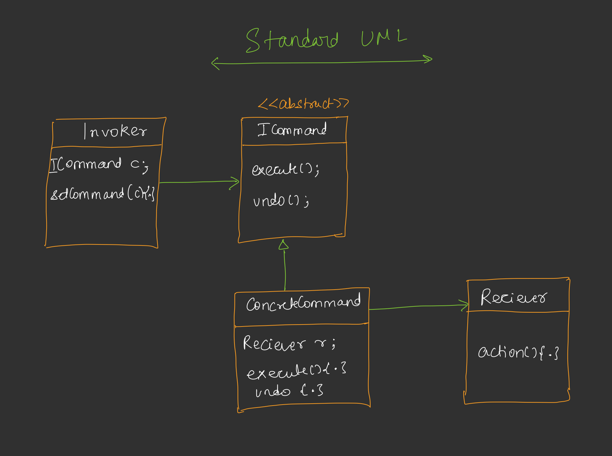
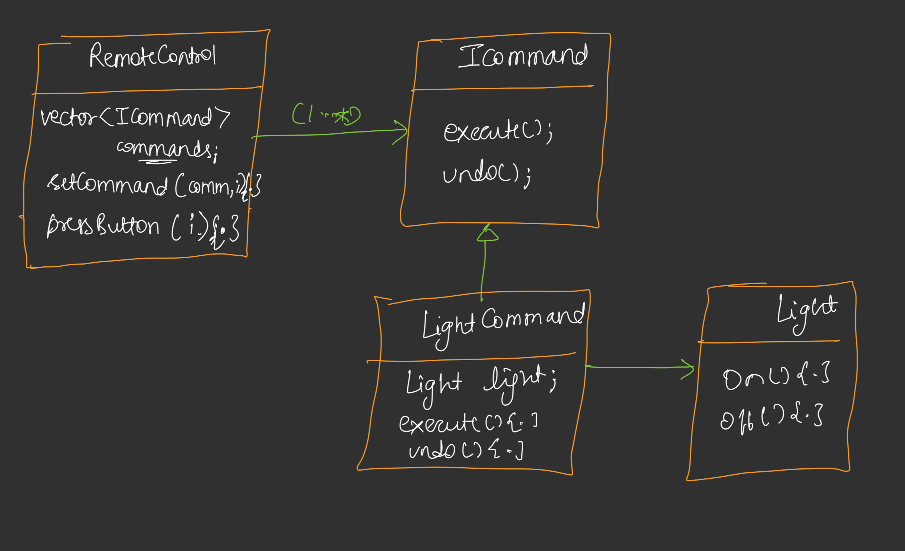

# Command Design Pattern
The **Command Design Pattern** is a behavioral design pattern that turns a request into a stand-alone object containing all information about the request. This transformation allows you to pass requests as method arguments, delay or queue a request's execution, and support undoable operations.

---

## **1. The Problem to Solve**
The core problem is how to manage requests or actions sent from a **source** (the invoker) to a **receiver** (the object performing the action) without them being inextricably linked. 

In a real-world scenario, imagine building a **smart home automation system**. You have a remote control (the source) with multiple buttons intended to control various devices like **lights, fans, and air conditioners** (the receivers). The challenge is to design a system where the remote can trigger these actions efficiently and flexibly.

## **2. The Naive Method and Its Problems**
The **naive approach** involves creating a `Remote` class that directly contains objects of the devices it controls, such as a `Light` or `Fan` object. When a button is pressed, the remote calls a specific method on that object, such as `light.on()`.

**Problems with the naive method:**
*   **Tight Coupling:** The `Remote` is directly linked to specific device classes. 
*   **Violation of the Open-Closed Principle:** If you want to add a new device (like a smart heater) or change which button controls which device, you must modify the existing code of the `Remote` class.
*   **Lack of Flexibility:** You cannot easily reassign a button to a different task at runtime or implement a dynamic "plug and play" model.

## **3. The Efficient Approach: First Principles**
The efficient solution is to treat a **request as an object**. Instead of the source talking directly to the receiver, you introduce a **Command object** in between them.
*   The **Source (Invoker)** tells the **Command** to "execute".
*   The **Command** holds a reference to the **Receiver** and knows exactly which method to call to fulfill the request.
*   This approach ensures that the source and receiver are **loosely coupled**.

## **4. How This Approach Solves the Problem**
By encapsulating requests, the `Remote` no longer needs to know the internal details of the devices. It only interacts with a generic **Command interface**. 
*   **Dynamic Reassignment:** You can change what a button does at runtime by simply assigning a new command object to that button index using a `setCommand` method.
*   **Delegation:** The remote simply **delegates** the task to the command object, saying "go do something," and the command handles the specifics of talking to the light or fan.

## **5. UML Diagram Explanation**
The standard UML for the Command Pattern in this system includes:

*   **ICommand (Interface/Abstract Class):** Defines the contract, containing methods like `execute()` and `undo()`.
*   **Concrete Command (e.g., `LightCommand`):** Implements `ICommand`. It has a **"has-a" relationship** with a specific receiver (e.g., a `Light` object) and defines what happens during execution and undoing (e.g., calling `light.on()` and `light.off()`).
*   **Receiver (e.g., `Light`, `Fan`):** The actual object that performs the low-level work, such as drawing current to light a filament.
*   **Invoker (e.g., `RemoteControl`):** Holds a **vector or array of Commands**. It triggers the `execute()` or `undo()` methods based on user interaction.

## **6. Example Explanation**
In the provided code example, a `RemoteControl` is implemented with:

*   **Command Storage:** A `buttons` array of type `Command` and a `buttonPressed` **boolean array** to track the state of each button.
*   **Initialization:** All buttons are initially set to `null`.
*   **Mapping:** The `setCommand(index, command)` method maps a specific action (like a `LightCommand` for the "Living Room Light") to a specific button.
*   **Toggling Logic:** When `pressButton(index)` is called, the system checks `buttonPressed[index]`. If `false`, it calls **`execute()`** and sets the state to `true` (On). If `true`, it calls **`undo()`** and sets the state to `false` (Off).

## **7. Real-World Use Cases**
*   **Undo/Redo Functionality:** Applications like **Photoshop** or **Text Editors** treat every action (bolding text, applying a filter) as a command object. These commands are stored in a **stack**; pressing "Undo" pops the last command and calls its `undo()` method.
*   **Keyboard Shortcuts:** Modern OSs allow users to map keys to actions. The keyboard doesn't link to the monitor directly; it triggers a command object that can be dynamically changed (e.g., remapping a key from "Brightness" to "Volume").
*   **Request Queueing and Logging:** Commands can be stored in a queue to be executed sequentially or logged for audit trails and recovery.

## **8. Doubts and Resolutions**
*   **Why is the Receiver reference in the Concrete Command, not the Interface?**
    *   **Resolution:** This is about **intent**. The generic `ICommand` interface should remain abstract, defining only that *something* can be executed. The **Concrete Command** carries the specific intent, knowing exactly which receiver it needs to talk to.
*   **Why not use a generic "Appliance" interface for all Receivers?**
    *   **Resolution:** This would violate the **Liskov Substitution Principle (LSP)**. Not all appliances are the same; a `Fan` has speed settings, while an `AC` has timers and temperature controls. A single interface cannot practically cover all unique features of every device without creating irrelevant methods for some. Using concrete commands for concrete receivers keeps the design simple and robust.