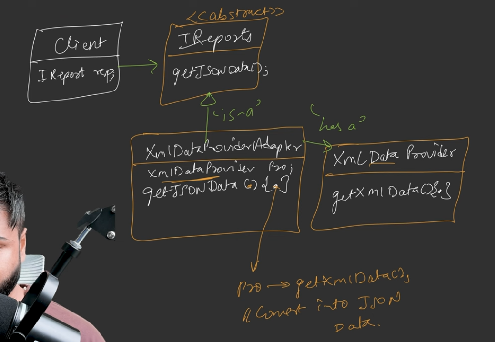
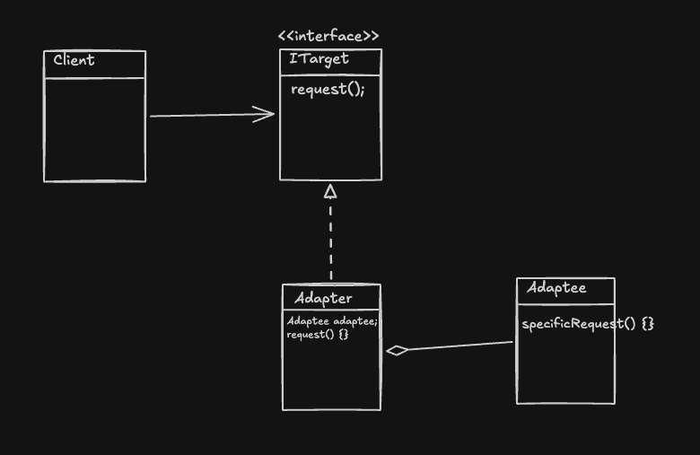

# Adapter Design Pattern | System Design

## Problem That We Are Trying To Solve
When building software applications, developers frequently need to integrate third-party libraries, external vendors, or legacy code. However, these external components often have completely different interfaces, methods, and return types compared to the existing application code. Because these interfaces are incompatible, they cannot communicate or work together directly. 

## Explanation of the Situation on Which the Example is Based Upon
The system example revolves around an application client that expects to fetch report data strictly in **JSON format**. The client interacts with an interface called `IReports`, which defines a `getJSONData()` method. However, the developers want to utilize a third-party library named `XMLDataProvider` to fetch the raw data. The problem is that this library only outputs data in **XML format** via a completely different method called `getXMLData()`. Because the client expects JSON and the library provides XML, the two components are entirely incompatible.

## Naive Solution
The naive approach is to reserve a specific section within your existing core application code to directly call the methods of the third-party library and handle the conversions. 

## Why Naive Solution is Not a Good Design
Directly calling the third-party library creates **tight coupling** between your core application and the external code. If you ever need to replace the third-party library with a different one (for instance, switching from Library A to Library B because it is more cost-efficient or performant), you will be forced to make significant changes to your existing core codebase, which is a poor architectural practice.

## Efficient Solution via First Principles
The efficient solution involves creating an intermediary class—an adapter—acting much like puzzle pieces connecting mismatched parts. 
    
*   An `XMLDataProviderAdapter` class is created to bridge the gap. 
*   This adapter inherits from the `IReports` interface (an *is-a* relationship), meaning it exposes the `getJSONData()` method the client expects.
*   Simultaneously, the adapter holds a reference to the third-party `XMLDataProvider` via composition (a *has-a* relationship). 
*   When the client calls `getJSONData()` on the adapter, the adapter internally calls the provider's `getXMLData()` method, converts the received XML string into JSON format, and securely returns it to the client. The client remains completely unaware of the third-party library.

## Standard UML Diagram Explanation
The standard UML architecture for the Adapter pattern consists of the following components:

*   **Target Interface (`IReports`)**: The interface the client knows and expects to interact with. It contains the standard method (`Request` / `getJSONData`).
*   **Adaptee (`XMLDataProvider`)**: The incompatible third-party class or interface that needs to be adapted. It has a different, specific method (`SpecificRequest` / `getXMLData`).
*   **Adapter (`XMLDataProviderAdapter`)**: The bridge class. It implements the Target interface and contains a reference to the Adaptee. It overrides the target request to internally call the Adaptee's specific request.
*   **Client**: Interacts solely with the Target interface, completely decoupled from the Adaptee.

## Definition of the Design Pattern
The Adapter pattern converts the interface of a class into another interface that clients expect. It lets classes work together that couldn't otherwise collaborate because of incompatible interfaces. 

## Real World Use Cases
*   **Hardware Analogies:** Using an international travel adapter to plug an Indian charger into a US wall socket, or using a dongle to adapt a Type-C cable to a Type-B port.
*   **Integrating Third-Party Vendors:** When your application needs to seamlessly communicate with external libraries like payment gateways (e.g., Razorpay) or notification systems without tightly coupling your code to them.
*   **Legacy Code Integration:** When a modern application (e.g., built on Java 22) needs to interact with an outdated legacy codebase (e.g., pre-Java 8) that utilizes deprecated or completely differently structured methods. 

## Doubts Regarding the Design Pattern and How They are Justified
**What is the difference between an "Object Adapter" and a "Class Adapter"?**
The standard implementation uses an **Object Adapter**, which utilizes composition (a *has-a* relationship) to wrap the Adaptee. Alternatively, a **Class Adapter** relies on multiple inheritance to inherit from both the Target interface and the Adaptee simultaneously.

**Justification:** Modern software engineering dictates that we should "prefer composition over inheritance". Because of this, the Object Adapter is overwhelmingly preferred. Furthermore, many popular languages, such as Java, do not support multiple inheritance, making Class Adapters impossible to implement in those environments. 

## When to Use That Particular Design Pattern
You should use the Adapter design pattern whenever you have an existing codebase and a third-party library (or legacy code) that need to interact, but cannot do so directly because their interfaces, method names, or data formats are completely incompatible. It is used specifically to avoid tightly coupling your core application code to external dependencies.

## How is it Different From Other Design Pattern That Might Look Similar
While the Adapter pattern bridges incompatible interfaces, the key distinction discussed is within its own variations: **Object Adapter vs. Class Adapter**. The Class Adapter uses rigid multiple inheritance (acting as both the target and the adaptee), whereas the universally preferred Object Adapter acts dynamically as the target while securely composing the adaptee inside itself. 

***

Would you like me to generate flashcards to help you memorize the definitions and UML relationships of this pattern?