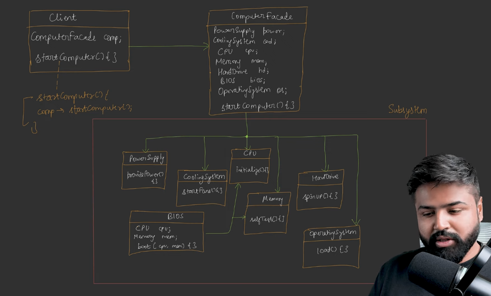
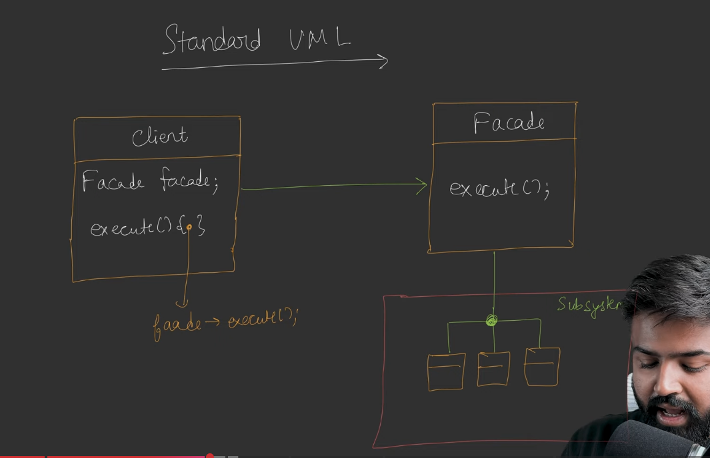

# Facade Design Pattern | System Design

## Problem That We Are Trying to Solve
In software development, we often encounter a **highly complex subsystem of interconnected classes** (e.g., classes A, B, C, D) that depend on one another to perform a combined task. If a client wants to use this subsystem, forcing the client to interact directly with multiple complex classes creates tight coupling and makes the system extremely difficult to manage. 

## Explanation of the Situation on Which the Example is Based Upon
The primary example is based on **booting up a computer**. When you press the start button on your computer, a massive chain of complex internal operations occurs: the CPU initializes, the memory runs a self-test, the BIOS boots up (which requires the CPU and memory), the hard disk spins up, and the operating system loads. 

## Naive Solution
A naive solution would require the client to manually and sequentially call the methods of every single internal class. The client code would have to instantiate the CPU, start the memory self-test, manually load the BIOS, and spin the hard drive to get the computer to start.

## Why Naive Solution is Not a Good Design
This naive approach is poor design because it creates **tight coupling** between the client and the complex subsystem. If the internal subsystem changes—for example, if new classes are introduced or interactions are modified—the client's code will break. Furthermore, it severely violates the **Principle of Least Knowledge**, which states that classes should minimize interactions with other unknown classes to remain loosely coupled.

## Efficient Solution via First Principles
The efficient solution is to introduce a new **Facade class** that acts as a simple gateway between the client and the complex subsystem. 

*   The Facade class encapsulates all the complicated interactions of the subsystem classes.
*   The client is only given access to a single, simplified method on the Facade, such as `startComputer()`.
*   When the client calls `startComputer()`, the Facade internally handles the heavy lifting of calling the CPU, Memory, BIOS, and Hard Drive in the correct order. 
*   **The client remains completely unaware of the underlying complexity**.

## Standard UML Diagram Explanation
The standard UML architecture for the Facade pattern is straightforward:

*   **Client:** Interacts solely with the Facade class and has no knowledge of the subsystem.
*   **Facade:** Contains a simplified method (like `execute()` or `startComputer()`). Internally, it holds references to the various classes of the subsystem.
*   **Complex Subsystem:** A large set of interacting classes that perform the actual work, completely uncoupled from the direct client.

## Real World Use Cases
*   **Gaming Engines (e.g., Unity):** When a client loads a game, they simply trigger a `startGame()` facade method. Internally, a massive subsystem handles loading game assets, memory management, and initializing the physics engine.
*   **Payment Gateways:** A user simply calls `makePayment()`. Behind the scenes, the subsystem checks the account balance, verifies the PIN, checks for fraud, and triggers notification systems.

## Doubts Regarding the Design Pattern and How They are Justified
**How does this pattern justify and enforce the "Principle of Least Knowledge"?**
The Facade pattern enforces this principle (also known as the Law of Demeter) by strictly dictating that a class should **"Talk only to your immediate friends"**. To avoid a fragile, tightly coupled design, a class should only call methods belonging to:
1.  Itself (its own objects).
2.  Objects passed to it as parameters.
3.  Objects it creates itself within a method.
4.  Objects it shares a direct *has-a* (composition) relationship with.
By putting a Facade in the middle, the client only talks to its "immediate friend" (the Facade), completely hiding the complex web of subsystem classes.

## When to Use That Particular Design Pattern
You should use the Facade design pattern whenever you need to provide a **simplified, unified interface to a large and complex subsystem**. It is highly useful when you want to hide internal system complexity from a user or client application, reducing dependencies and keeping the application loosely coupled.

## How is it Different From Other Design Pattern That Might Look Similar
The Facade pattern looks structurally very similar to the **Adapter pattern**, as both introduce a middle-man class between the client and a system. However, they have completely different intents:
*   **Facade Intent:** Designed purely to **hide the complexity** of a large subsystem to make it easier for a client to use.
*   **Adapter Intent:** Designed to make **two completely incompatible interfaces interact** with each other. 

## Explain the Design Pattern by Taking an Example of an Order Booking Flow
*(Note: The specific order booking flow example is not explicitly detailed in the provided sources. However, based on the core Facade principles and the Payment Gateway example provided in the text, here is how it would be architected).*

In an **Order Booking Flow** (like Swiggy or Amazon), the subsystem is incredibly complex. 
*   **The Subsystem Classes:** You would have an `InventoryManager` (to check stock), a `PaymentProcessor` (to deduct money), a `LogisticsSystem` (to assign a delivery partner), and a `NotificationService` (to email the receipt). 
*   **The Naive Way:** The client app would have to call all four of these services individually and handle their complex responses.
*   **The Facade Way:** We create an `OrderFacade` class with a single method: `placeOrder()`. The client simply calls `OrderFacade.placeOrder()`. The Facade internally checks the inventory, processes the payment, assigns the delivery, and sends the notification. The client gets a simple "Order Successful" message, completely insulated from the heavy backend processes.