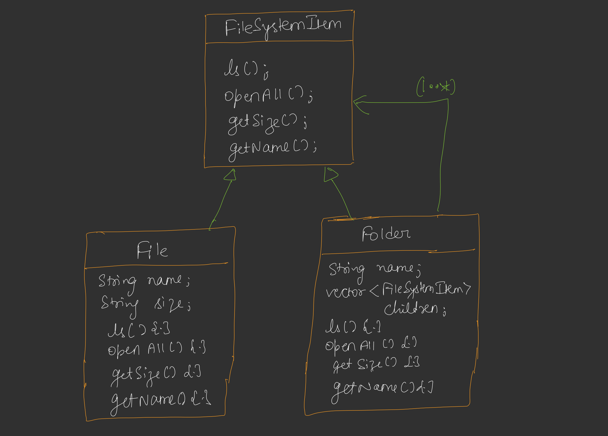
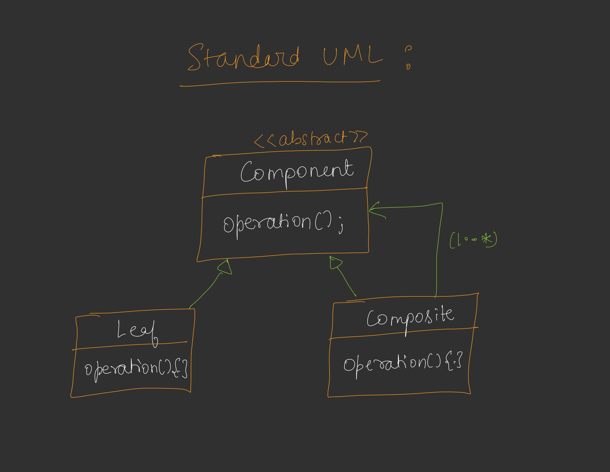

These notes on the **Composite Design Pattern** are based on the provided source, which uses a file system design as the primary case study.

## **1. The Problem We Are Trying to Solve**
The core problem is managing **hierarchical data structures** that can be represented as trees. Specifically, we often encounter scenarios where we have two types of objects:
*   **Leaf Nodes:** Endpoints that cannot contain other items (e.g., a File).
*   **Composite/Intermediate Nodes:** Items that can contain both leaf nodes and other intermediate nodes (e.g., a Folder).

The challenge is to perform operations across this hierarchy (like calculating total size or listing all contents) without the code becoming cluttered with checks to see which type of object we are dealing with.

## **2. The Naive Method and Its Problems**
In a naive approach, you would create separate, unrelated classes for `File` and `Folder`.
*   **Structure:** A `File` class would have attributes like name and size. A `Folder` class would maintain **two separate lists**: one for `Files` and one for `Folders`.
*   **The Problems:**
    *   **Order Maintenance:** If a folder has a file, then a subfolder, then another file, keeping them in that specific order is difficult with two separate lists.
    *   **Complex Logic:** Operations like `openAll()` (expanding the whole tree) require looping through the file list, then looping through the folder list, and using **type checking** (`if/else`) to decide how to handle each.
    *   **Scalability:** Adding a new operation (like `cd` or `getSize`) requires updating both classes and adding more complex conditional logic everywhere the objects are used.

## **3. The Efficient Approach: First Principles**
The efficient approach is to treat **Leaf** and **Composite** objects **uniformly**.

*   **Building from First Principles:** Instead of seeing them as different entities, we identify them as "Items" of the same system. We create a **common interface** or abstract class (e.g., `FileSystemItem`).
*   **Polymorphism:** By making both `File` and `Folder` implement the same interface, a `Folder` only needs **one list** of `FileSystemItem`. This list can hold both files and other folders seamlessly.

## **4. How This Approach Solves the Problem**
This approach eliminates the need for `if/else` type checking. When you call an operation like `ls()` or `getSize()` on the root:
*   The system doesn't care if the item is a file or a folder.
*   It simply calls the method, and **polymorphism** ensures the correct version runs.
*   For a Folder, the method will likely involve **recursion**—it calls the same method on all its children, which might call it on their children, until the leaf nodes (Files) are reached.

## **5. Definition of the Composite Design Pattern**
The **Composite Design Pattern** composes objects into tree structures to represent **part-whole hierarchies**. It lets clients treat individual objects (Leaf) and compositions of objects (Composite) **uniformly** through a common interface.

## **6. UML Diagram Explanation**
The standard UML for this pattern involves three main parts:

*   **Component (Interface/Abstract Class):** Declares the interface for all objects in the composition (e.g., `FileSystemItem`).
*   **Leaf:** Represents the end objects that have no children. It implements the component operations (e.g., `File`).
*   **Composite:** Stores child components and implements child-related operations. It also implements the component interface, often by delegating the work to its children via recursion (e.g., `Folder`).
*   **Relationships:**
    *   **Is-a:** Both Leaf and Composite "are" Components.
    *   **Has-a:** The Composite "has" a list of Components.

## **7. Example Explanation: File System**
In the source example, the `FileSystem` is built as follows:
*   **Interface (`FileSystemItem`):** Defines methods like `ls()`, `openAll()`, and `getSize()`.
*   **`File` (Leaf):** `ls()` simply prints the file name; `getSize()` returns its specific size.
*   **`Folder` (Composite):** 
    *   `ls()` loops through its `children` list and calls `getName()` on each.
    *   `getSize()` loops through children, calls `getSize()` on each, and returns the **total sum**. If a child is another folder, it triggers a recursive call to its own children.
*   **Result:** A single call to `root.getSize()` triggers a recursive traversal of the entire tree, summing up every file regardless of how deep it is hidden in subfolders.

## **8. Real-World Use Cases**
*   **File Systems:** Managing directories and files in an OS.
*   **UI Components:** Front-end dropdown menus where a menu item can be a final action (Leaf) or contain another submenu (Composite).
*   **XML/HTML Parsers:** Elements can be standalone tags (Leaf) or tags containing other tags (Composite).
*   **Organization Charts:** An employee (Leaf) vs. a manager who has a team of employees and other managers (Composite).

## **9. Doubts and Challenges**
*   **Incompatible Operations:** What if an operation like `cd` (change directory) makes sense for a Folder but not for a File?
    *   **Solution:** In the source, this is handled by returning a `null` pointer or an error message if `cd` is called on a `File`. Another way is using a helper method like `isFolder()` to check capabilities before performing specific actions.
*   **Uniformity vs. Safety:** Treating everything the same (Uniformity) makes the client code very simple, but it might lead to "illegal" calls (like trying to add a child to a File). Developers must decide whether to put child-management methods in the base interface (Uniformity) or only in the Composite class (Safety).