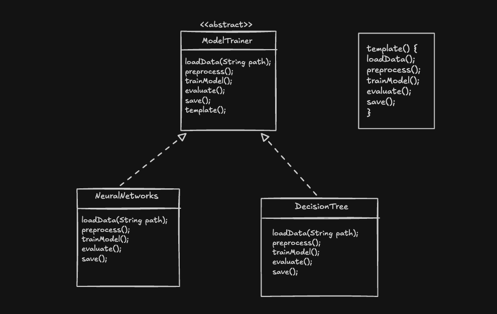
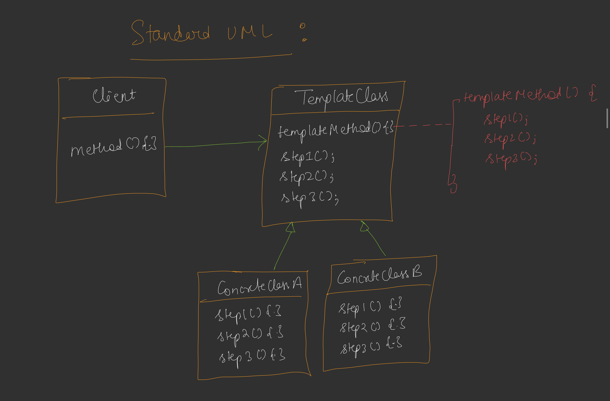

These notes on the **Template Method Pattern** are based on the provided source, which uses a machine learning pipeline as the primary case study for understanding this behavioral design pattern.

## **1. The Problem We Are Trying to Solve**
The core problem involves managing **pipelines** or a specific list of steps that must be followed in a strict sequence. In complex workflows, such as a Machine Learning pipeline, you must follow a fixed order:
*   **Load Data**
*   **Pre-process Data**
*   **Train Model**
*   **Evaluate Result**
*   **Save Model**

The difficulty arises when multiple developers work on different models (e.g., Neural Networks, Decision Trees). Without a standard structure, there is no guarantee they will follow the correct sequence.

## **2. The Naive Method and Its Problems**
In a naive approach, you would simply create separate classes for each model and rely on the developer to call the methods in the right order.
*   **The Problems:**
    *   **Human Error:** A developer might accidentally skip a crucial step, such as training a model without pre-processing the data.
    *   **Inconsistency:** Different developers might execute steps in different orders, leading to unpredictable results.
    *   **Code Duplication:** Common logic (like loading data from a specific file type) might be repeated across all model classes instead of being shared.

## **3. The Efficient Approach: First Principles**
The efficient approach is to provide a **"Template"** that defines the algorithm's structure.

*   **Abstract Base Class:** Create a generic class (e.g., `ModelTrainer`) that declares all necessary steps as methods.
*   **The Template Method:** Implement a single, fixed method in this base class that calls all the other step-methods in the **exact order required**.
*   **Fixed Structure:** This main method should be protected from being overridden (using `final` in Java or `const` in C++) to ensure the pipeline structure never changes.

## **4. How This Approach Solves the Problem**
By using this approach, the **order of execution is centralized** in the parent class. 
*   Subclasses (like `NeuralNetwork`) are only responsible for **overriding the specific implementation** of the steps, not the order.
*   When a client calls the template method, the parent class ensures that Step 1 happens before Step 2, regardless of which concrete model is being used.

## **5. Definition of the Template Method Pattern**
The **Template Method Pattern** defines the **skeleton of an algorithm** in an operation, deferring some steps to subclasses. it lets subclasses redefine certain steps of an algorithm **without changing the algorithm's structure**.

## **6. UML Diagram Explanation**
The UML for this pattern consists of:

*   **Abstract Class (Template):** 
    *   Contains the `TemplateMethod()` which is **defined** (not abstract) and contains the sequence of calls.
    *   Contains several `PrimitiveOperations()` (Step 1, Step 2, etc.) which are usually **abstract**.
*   **Concrete Class:** 
    *   Inherits from the Abstract Class and **overrides** the `PrimitiveOperations` to provide specific logic.
*   **Relationships:**
    *   **Is-a Relationship:** Concrete classes "are" types of the Abstract Template.
    *   **Client Relationship:** The client has a "has-a" relationship with the Abstract Class, calling only the `TemplateMethod` to trigger the pipeline.

## **7. Example Explanation: ML Model Trainer**
*   **Base Class (`ModelTrainer`):** Defines `trainPipeline()` as the template method. It calls `loadData()`, `preprocess()`, `trainModel()`, `evaluate()`, and `saveModel()` in order.
*   **Concrete Class A (`NeuralNetworkModel`):** Implements specific logic for training using "epochs" and specific accuracy evaluations.
*   **Concrete Class B (`DecisionTreeTrainer`):** Implements its own versions of training and evaluation, but might reuse the default `preprocess()` method from the parent if it's common.
*   **Execution:** Even if `DecisionTree` implements its methods in a random order in its own file, calling `trainPipeline()` ensures the data is loaded before it is trained.

## **8. Real-World Use Cases**
*   **Machine Learning Frameworks:** Ensuring data flows correctly from ingestion to deployment.
*   **Payment Gateways:** A strict pipeline of **Validate -> Debit -> Credit -> Finalize Transaction**. You cannot credit a merchant before successfully debiting the user.
*   **Software Build Tools:** Steps like Compile -> Test -> Package -> Deploy follow a template where the specific compiler or test runner might change, but the order stays the same.

## **9. Doubts and Challenges**
*   **What if some steps are identical for all subclasses?**
    *   **Solution:** You can define the implementation in the base class itself (non-abstract). Subclasses can then choose to use the default or override it if they need something special.
*   **What if a developer overrides the template method and changes the order?**
    *   **Solution:** Use language keywords like **`final`** (Java) or **`sealed`** to prevent the template method from being overridden, ensuring the "skeleton" remains intact.
*   **What if a subclass doesn't need all the steps?**
    *   **Solution:** You can provide "hooks" (empty methods) in the base class. Subclasses only override the hooks they actually need.